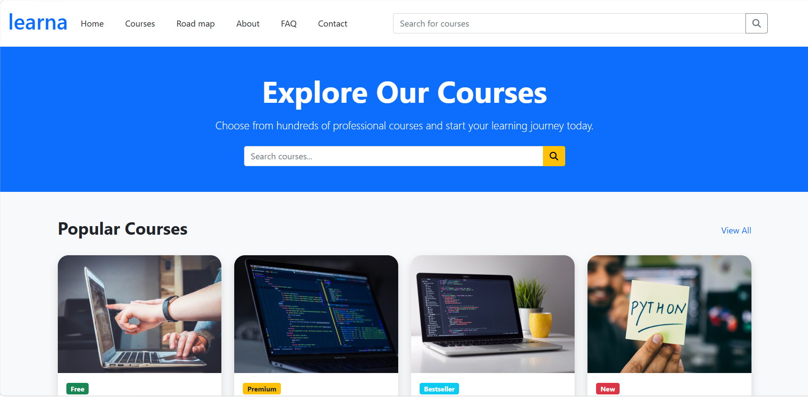
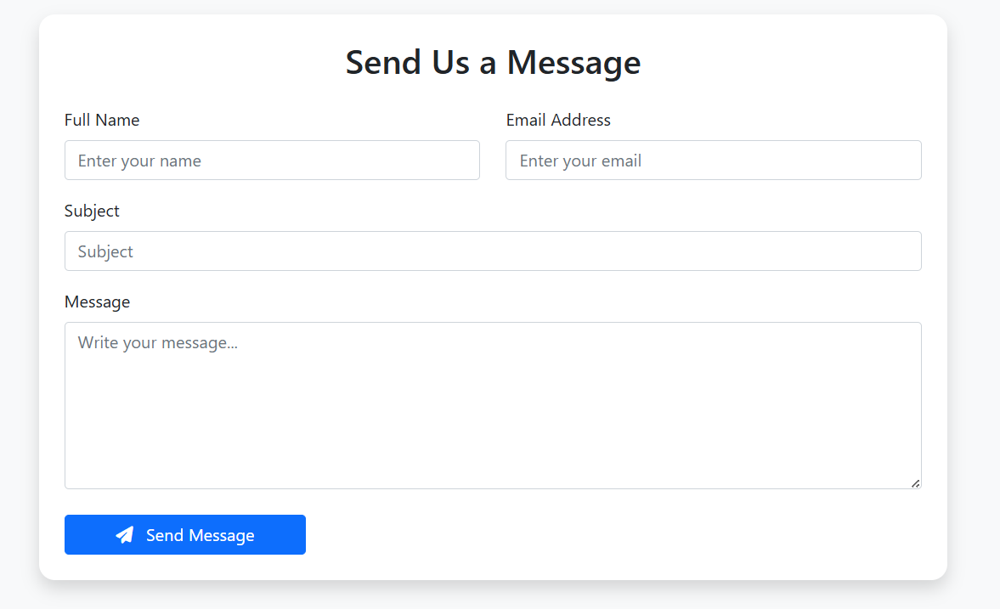

# 🎓 Learna - Online Learning Platform

Learna is a responsive online learning platform built to provide a modern and engaging user experience for students. The project focuses on creating a clean UI, smooth navigation, and a fully responsive layout using Bootstrap.

## 🚀 Live Demo
🔗 https://website-learna.vercel.app/

## 📂 GitHub Repository
🔗https://github.com/hammadhammadamr-create/Website-use-bootstrap

## ✨ Features

- Responsive design for all screen sizes
- Modern and clean user interface
- Multi-page website
- Course slider
- User authentication pages (Login & Sign Up)
- Interactive navigation
- Organized project structure
- Fast and lightweight

## 🛠️ Technologies Used

- HTML5
- CSS3
- Bootstrap 5
- JavaScript (ES6)
- Font Awesome
- Bootstrap Icons

## 📱 Responsive Design

The website is fully responsive and optimized for:

- Desktop
- Tablet
- Mobile

## 📸 Screenshots

### Course

### About

### Contact

## 📌 Future Improvements

- Backend integration
- User authentication with database
- Course management system
- Payment integration
- User dashboard

## 👨‍💻 Author
**Hammad**

If you like this project, don't forget to ⭐ the repository.
